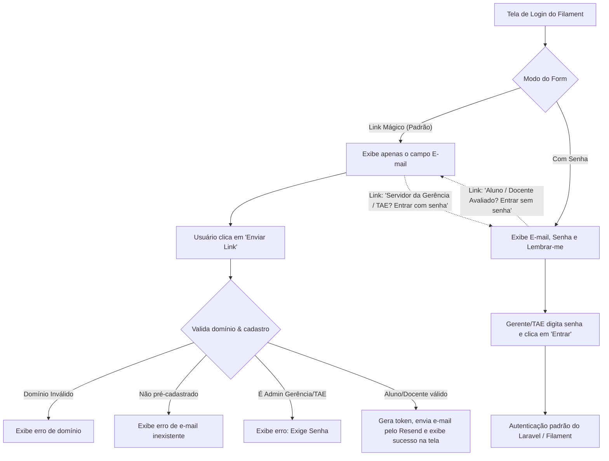

# Plano de Implementação: Login por Link Mágico Integrado (GeaD)

Esta especificação detalha a implementação de uma solução **própria, reativa e integrada diretamente na tela de login do Filament** para o **GeaD**, sem depender de modais adicionais ou plugins externos.

---

## 1. Visão Geral do Fluxo de Login e Regras de Acesso

A tela de login do Filament alternará reativamente entre o login tradicional e o login por Link Mágico, obedecendo às seguintes regras de acesso institucionais:

* **Link Mágico (Acesso sem Senha):**
  * **Público:** Alunos (domínio `@estudante.ifto.edu.br`) e Docentes avaliados (domínio `@ifto.edu.br`).
  * **Validação:** O usuário deve estar pré-cadastrado no banco de dados. Contas que possuem a role global `Admin` (Gerência/TAE) serão bloqueadas de usar este fluxo e direcionadas para o login por senha.
* **Login Tradicional (E-mail + Senha):**
  * **Público:** Servidores da Gerência de Ensino e TAEs da gerência (que possuem a role global `Admin`).



---

## 2. Componentes da Implementação

A solução necessita de apenas **3 novos arquivos** e **2 modificações** no código existente, sem nenhuma view Blade extra.

---

### [NEW] 1. Migration de Tokens (`CreateMagicLoginTokensTable.php`)
[CreateMagicLoginTokensTable.php](file:///home/iury/Projetos/GeaD/database/migrations/2026_06_10_000000_create_magic_login_tokens_table.php)

Tabela para gerenciar a expiração e consumo dos links mágicos.
```php
use Illuminate\Database\Migrations\Migration;
use Illuminate\Database\Schema\Blueprint;
use Illuminate\Support\Facades\Schema;

return new class extends Migration {
    public function up(): void
    {
        Schema::create('magic_login_tokens', function (Blueprint $table) {
            $table->id();
            $table->string('email')->index();
            $table->string('token', 64)->unique(); // Hash SHA256 do token
            $table->timestamp('expires_at');
            $table->timestamps();
        });
    }

    public function down(): void
    {
        Schema::dropIfExists('magic_login_tokens');
    }
};
```

---

### [NEW] 2. Notificação de E-mail (`MagicLinkNotification.php`)
[MagicLinkNotification.php](file:///home/iury/Projetos/GeaD/app/Notifications/Auth/MagicLinkNotification.php)

Gera e envia a mensagem contendo a rota de callback via SMTP do Resend.
```php
namespace App\Notifications\Auth;

use Illuminate\Notifications\Notification;
use Illuminate\Notifications\Messages\MailMessage;

class MagicLinkNotification extends Notification
{
    public function __construct(protected string $token) {}

    public function via($notifiable): array
    {
        return ['mail'];
    }

    public function toMail($notifiable): MailMessage
    {
        $url = route('magic.callback', ['token' => $this->token]);

        return (new MailMessage)
            ->subject('Link de Acesso ao GeaD')
            ->greeting('Olá!')
            ->line('Clique no botão abaixo para entrar no sistema GeaD de forma segura.')
            ->action('Entrar no Sistema', $url)
            ->line('Este link é válido por 15 minutos e só pode ser usado uma vez.')
            ->line('Se você não solicitou este link, por favor ignore este e-mail.');
    }
}
```

---

### [NEW] 3. Rota & Controller de Autenticação (`MagicLinkController.php`)
[MagicLinkController.php](file:///home/iury/Projetos/GeaD/app/Http/Controllers/Auth/MagicLinkController.php)

Valida o token na URL, atualiza o status de aprovação/sincronização do aluno e realiza o login.
```php
namespace App\Http\Controllers\Auth;

use App\Http\Controllers\Controller;
use App\Models\User;
use App\Models\Team;
use App\Models\Membership;
use App\Enums\RoleType;
use App\Enums\AppTeamRole;
use Illuminate\Support\Facades\DB;
use Illuminate\Support\Facades\Auth;

class MagicLinkController extends Controller
{
    public function callback(string $token)
    {
        $hashedToken = hash('sha256', $token);
        
        $magicToken = DB::table('magic_login_tokens')
            ->where('token', $hashedToken)
            ->where('expires_at', '>', now())
            ->first();

        if (!$magicToken) {
            return redirect()->to(filament()->getLoginUrl())
                ->withErrors(['email' => 'Link inválido ou expirado. Por favor, solicite um novo.']);
        }

        // Deleta o token imediatamente (uso único)
        DB::table('magic_login_tokens')->where('token', $hashedToken)->delete();

        // Localiza usuário pré-cadastrado
        $user = User::where('email', $magicToken->email)->first();

        if (!$user) {
            return redirect()->to(filament()->getLoginUrl())
                ->withErrors(['email' => 'E-mail não cadastrado no sistema.']);
        }

        // Regras de ativação automática do aluno/docente pré-cadastrado
        $user->update([
            'is_approved' => true,
            'is_suspended' => false,
            'email_verified_at' => $user->email_verified_at ?? now(),
        ]);

        // Atribui papel 'user' se não possuir
        if (!$user->hasRole(RoleType::USER->value)) {
            $user->assignRole(RoleType::USER->value);
        }

        // Garante associação ao time/tenant se não possuir
        if (!$user->teams()->exists()) {
            $defaultTeam = Team::first() ?? Team::create([
                'name' => 'Campus Araguaína',
                'slug' => 'campus-araguaina',
                'is_personal' => false,
                'is_active' => true,
            ]);

            Membership::create([
                'team_id' => $defaultTeam->id,
                'user_id' => $user->id,
                'role' => AppTeamRole::MEMBER->value,
            ]);

            $user->forceFill(['current_team_id' => $defaultTeam->id])->save();
        }

        Auth::login($user);

        return redirect()->route('filament.user.pages.dashboard');
    }
}
```

---

### [MODIFY] 4. Ajustar Página de Login Customizada do GeaD (`Login.php`)
[Login.php](file:///home/iury/Projetos/GeaD/app/Filament/Pages/Auth/Login.php)

Integraremos o estado de Link Mágico e alternância no componente Livewire de Login atual, contendo a lógica de validação de papéis e domínios.

```php
namespace App\Filament\Pages\Auth;

use Filament\Pages\Auth\Login as BaseAuthLogin;
use Filament\Forms\Components\Placeholder;
use Filament\Forms\Form;
use Illuminate\Support\HtmlString;
use Illuminate\Support\Facades\DB;
use Illuminate\Support\Str;
use Illuminate\Validation\ValidationException;
use DanHarrin\LivewireRateLimiting\Exceptions\TooManyRequestsException;
use App\Notifications\Auth\MagicLinkNotification;
use App\Enums\RoleType;

class Login extends BaseAuthLogin
{

    // Propriedades reativas do Livewire
    public bool $magicLinkMode = true;
    public bool $magicLinkSent = false;

    public function toggleMode(): void
    {
        $this->magicLinkMode = !$this->magicLinkMode;
        $this->magicLinkSent = false;
    }

    public function resetMagicLinkForm(): void
    {
        $this->magicLinkSent = false;
        $this->form->fill();
    }

    #[\Override]
    public function form(Form $form): Form
    {
        return $form
            ->schema([
                // Mensagem de Sucesso exibida caso o link já tenha sido enviado
                Placeholder::make('successMessage')
                    ->hiddenLabel()
                    ->content(new HtmlString('
                        <div class="text-center py-4">
                            <div class="mb-3 text-green-600 dark:text-green-400">
                                <svg class="w-12 h-12 mx-auto" fill="none" viewBox="0 0 24 24" stroke="currentColor">
                                    <path stroke-linecap="round" stroke-linejoin="round" stroke-width="2" d="M3 19v-8.93a2 2 0 01.89-1.664l8-5.333a2 2 0 012.22 0l8 5.333A2 2 0 0121 10.07V19M3 19a2 2 0 002 2h14a2 2 0 002-2M3 19l6.75-4.5M21 19l-6.75-4.5M3 10l6.75 4.5M21 10l-6.75 4.5m0 0l-2.25-1.5a2 2 0 00-2.22 0l-2.25 1.5"/>
                                </svg>
                            </div>
                            <h3 class="text-lg font-bold text-gray-900 dark:text-white mb-2">Verifique seu e-mail!</h3>
                            <p class="text-sm text-gray-600 dark:text-gray-400 leading-relaxed">
                                Enviamos um link de login de uso único para o seu e-mail institucional. O link é válido por 15 minutos.
                            </p>
                        </div>
                    '))
                    ->visible(fn () => $this->magicLinkSent),

                $this->getEmailFormComponent()
                    ->visible(fn () => !$this->magicLinkSent),

                $this->getPasswordFormComponent()
                    ->visible(fn () => !$this->magicLinkSent && !$this->magicLinkMode),

                $this->getRememberFormComponent()
                    ->visible(fn () => !$this->magicLinkSent && !$this->magicLinkMode),

                // Link reativo de alternância entre Link Mágico e Senha
                Placeholder::make('toggleMode')
                    ->hiddenLabel()
                    ->content(fn () => new HtmlString(
                        $this->magicLinkMode 
                            ? '<div class="text-center text-sm pt-2"><a href="#" wire:click.prevent="toggleMode" class="text-primary-600 hover:underline font-semibold dark:text-primary-400">Servidor da Gerência / TAE? Entrar com senha</a></div>'
                            : '<div class="text-center text-sm pt-2"><a href="#" wire:click.prevent="toggleMode" class="text-primary-600 hover:underline font-semibold dark:text-primary-400">Aluno / Docente Avaliado? Entrar sem senha (Link Mágico)</a></div>'
                    ))
                    ->visible(fn () => !$this->magicLinkSent),
            ])
            ->statePath('data');
    }

    #[\Override]
    protected function getFormActions(): array
    {
        if ($this->magicLinkSent) {
            return [
                \Filament\Actions\Action::make('sendAnother')
                    ->label('Enviar outro link')
                    ->action('resetMagicLinkForm')
                    ->color('gray')
                    ->outlined()
                    ->button(),
            ];
        }

        return [
            $this->getAuthenticateFormAction(),
        ];
    }

    #[\Override]
    protected function getAuthenticateFormAction(): \Filament\Actions\Action
    {
        return parent::getAuthenticateFormAction()
            ->label(fn () => $this->magicLinkMode ? 'Enviar Link de Acesso' : 'Entrar');
    }

    public function authenticate(): ?\Filament\Http\Responses\Auth\Contracts\LoginResponse
    {
        if ($this->magicLinkMode) {
            $this->sendMagicLink();
            
            return null;
        }

        return parent::authenticate();
    }

    public function sendMagicLink(): void
    {
        try {
            $this->rateLimit(5);
        } catch (TooManyRequestsException $exception) {
            throw ValidationException::withMessages([
                'data.email' => __('filament-panels::pages/auth/login.notifications.throttled.title', [
                    'seconds' => $exception->secondsUntilAvailable,
                    'minutes' => ceil($exception->secondsUntilAvailable / 60),
                ]),
            ]);
        }

        $data = $this->form->getState();
        $email = strtolower(trim($data['email']));

        // 1. Valida o domínio institucional (aceita estudante.ifto.edu.br ou ifto.edu.br)
        $domain = substr(strrchr($email, "@"), 1);
        $allowedDomains = ['estudante.ifto.edu.br', 'ifto.edu.br'];
        
        if (!in_array($domain, $allowedDomains, true)) {
            throw \Illuminate\Validation\ValidationException::withMessages([
                'data.email' => 'Apenas e-mails institucionais do IFTO (@estudante.ifto.edu.br ou @ifto.edu.br) são permitidos.',
            ]);
        }

        // 2. Valida o pré-cadastro
        $user = \App\Models\User::where('email', $email)->first();
        if (!$user) {
            throw \Illuminate\Validation\ValidationException::withMessages([
                'data.email' => 'Este e-mail não está cadastrado no sistema. Por favor, entre em contato com a coordenação.',
            ]);
        }

        // 3. Restrição de Segurança: Se for Gerente ou TAE da Gerência (Role Admin), bloqueia o link mágico
        if ($user->hasRole(RoleType::ADMIN->value)) {
            throw \Illuminate\Validation\ValidationException::withMessages([
                'data.email' => 'Contas administrativas de Gerência/TAE exigem login por senha. Clique no link abaixo para entrar por senha.',
            ]);
        }

        // Limpa tokens anteriores
        DB::table('magic_login_tokens')->where('email', $email)->delete();

        // Gera token único e salva hash
        $token = Str::random(64);
        DB::table('magic_login_tokens')->insert([
            'email' => $email,
            'token' => hash('sha256', $token),
            'expires_at' => now()->addMinutes(15),
            'created_at' => now(),
        ]);

        // Dispara o e-mail
        $user->notify(new MagicLinkNotification($token));

        $this->magicLinkSent = true;
    }
}
```

---

### [MODIFY] 5. Configuração das Rotas (`web.php`)
[web.php](file:///home/iury/Projetos/GeaD/routes/web.php)

```php
Route::get('/auth/magic-login/{token}', [App\Http\Controllers\Auth\MagicLinkController::class, 'callback'])->name('magic.callback');
```

---

## 3. Plano de Verificação

### Testes Manuais
1. **Acesso Dinâmico (Aluno/Docente):** Acesse a tela de login. Verifique se o modo Link Mágico (padrão) aceita e-mails `@estudante.ifto.edu.br` e `@ifto.edu.br`.
2. **Bloqueio de Admin (Gerente/TAE) no Link Mágico:** Insira o e-mail de uma conta que possua a role `Admin`. Clique em *"Enviar Link de Acesso"* e valide se o sistema barra e informa que a conta exige login convencional com senha.
3. **Login de Gerente/TAE por Senha:** Clique no link *"Servidor da Gerência / TAE? Entrar com senha"*, insira as credenciais de e-mail/senha e confirme se o login ocorre normalmente.
4. **Disparo e Consumo do Link Mágico (Aluno/Docente):** Crie um usuário com e-mail `@ifto.edu.br` (sem papel `Admin`) e outro com `@estudante.ifto.edu.br`. Dispense os links e valide a autenticação automática e associação aos times após o callback.
